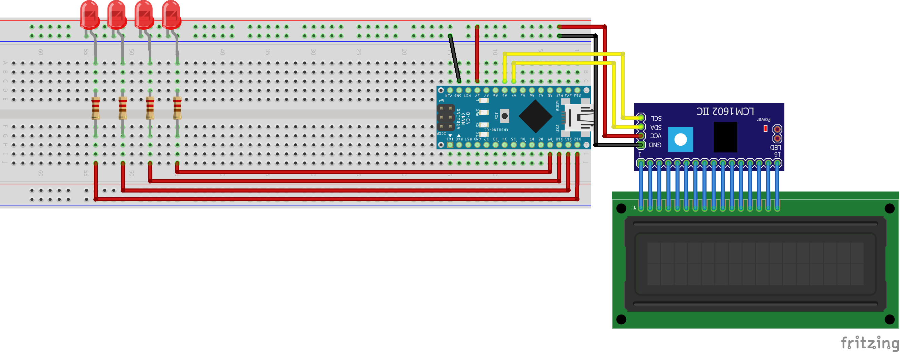

# 4 bit binary adder
This was a fun project for me to work on while learning how to do arduino electronic stuff.  My main interest was learning how to convert decimal to binary and display it will leds.  If the bit is on the led will light up and if the bit is off the led will not be lit.

I made this using a Nano V3.0, a 16x2 LCD with an IIC connection, 4 220 ohm resistors and 4 leds.  I used the [LiquidCrystal_I2C](https://github.com/johnrickman/LiquidCrystal_I2C?utm_source=platformio&utm_medium=piohome) library to control the lcd screen.
